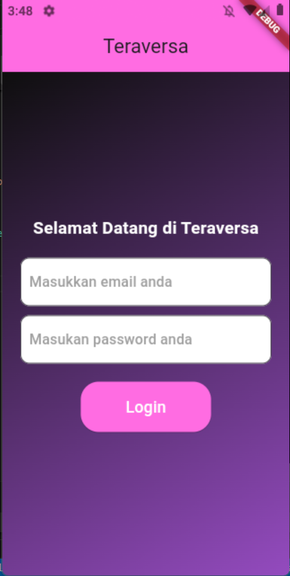
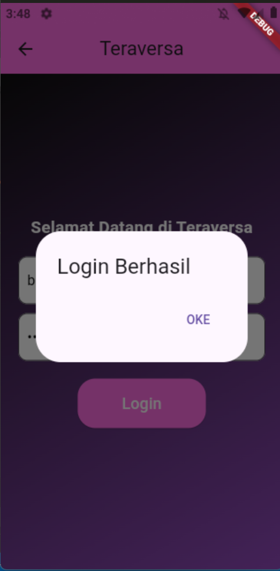
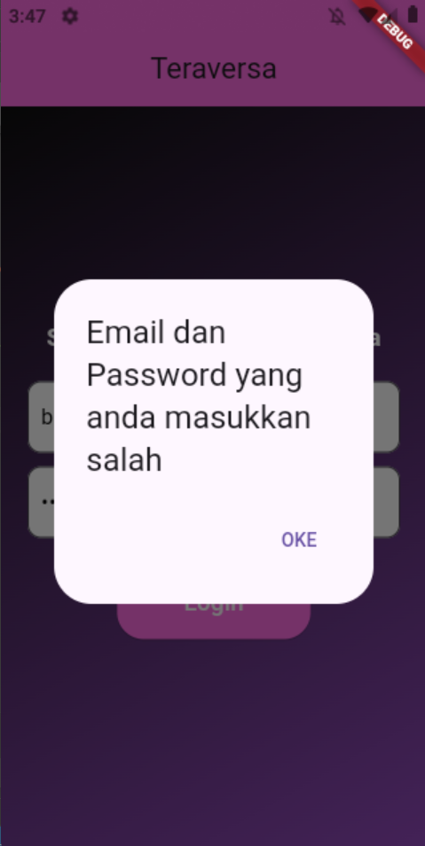
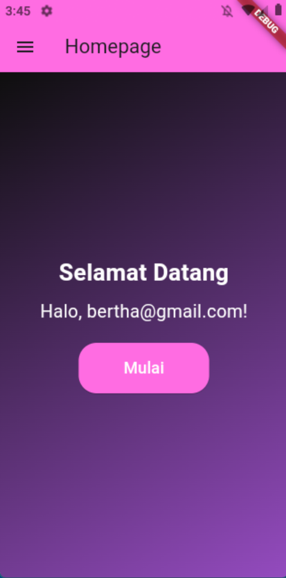
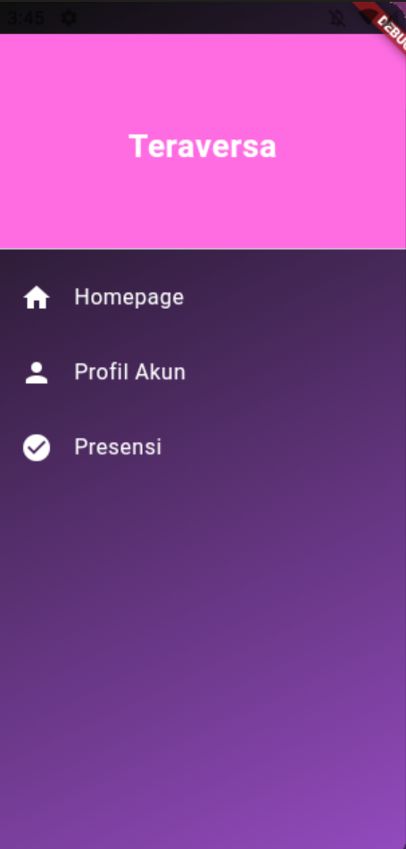
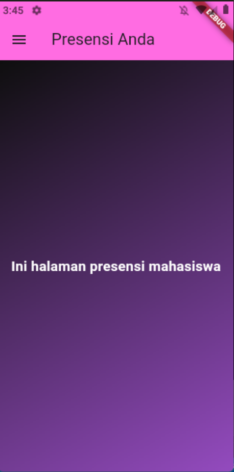
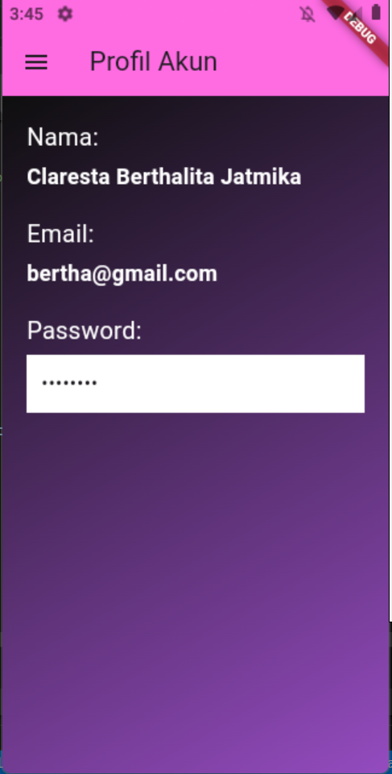

# Tugas 3
Nama : Claresta Berthalita Jatmika

NIM : H1D022050

Shift Baru: F

## Deskripsi Aplikasi
Aplikasi ini adalah aplikasi flutter sederhana yang mengusung materi terkait routes, login, dan local storage. Aplikasi ini memungkinkan pengguna untuk melakukan login dan jika berhasil masuk sistem akan menampilkan homepage dan fitur lainnya.

## Penjelasan kode program
### 1. **Inisialisasi**
Pada file 'main.dart', aplikasi akan dimulai dengan menjalankan fungsi 'main()' yang memanggil 'MyApp' sebagai widget utama.

### 2. **Halaman Login**
Sistem akan menampilkan halaman login dimana berisi 2 kolom input yaitu email dan password serta tombol untuk login. Selanjutnya pengguna dapat mengisi kolom login tersebut. Input pengguna akan disimpan pada variabel controller dibawah ini dengan menggunakan 'TextEditingController'.
```dart
final TextEditingController _emailController = TextEditingController();
  final TextEditingController _pwController = TextEditingController();
```


### 3. **Proses Login**
Saat tombol 'Login' ditekan, sistem akan memeriksa apakah email dan password sesuai dengan apa yang sudah ditentukan sebelumnya seperti kode dibawah ini. 
```dart
onPressed: () {
                if (_emailController.text == 'bertha@gmail.com' &&
                    _pwController.text == '123456') {
                  _saveEmail();
                  _liatPesan('Login Berhasil', const Homepage());
                } else {
                  _liatPesan(
                      'Email dan Password yang anda masukkan salah',
                      const Login());
                }
              },
```
Apabila sesuai, email akan disimpan dengan menggunakan 'SharedPreferences' dengan fungsi '_saveEmail()' dan akan diarahkan ke halaman 'Homepage. Selain itu juga akan muncul alert dari fungsi '_liatPesan()' bahwa login berhasil. Jika tidak sesuai, maka akan muncul alert dari fungsi '_liatPesan()' bahwa email dan password salah 
```dart
void _saveEmail() async {
    SharedPreferences prefs = await SharedPreferences.getInstance();
    prefs.setString('Email', _emailController.text);
  }
```
login berhasil 
login tidak berhasil 

### 4. **Halaman Homepage**
Jika login berhasil maka sistem akan menampilkan halaman Homepage. Dimana pada halaman ini akan ada pesan "Selamat datang" dan dibawahnya terdapat email dari pengguna yang login. Email ini diambil dari 'SharedPreferences' dengan fungsi '_loadUser()'.
```dart
void _loadUser() async {
    SharedPreferences prefs = await SharedPreferences.getInstance();
    user = prefs.getString('Email') ?? 'User';
    setState(() {});
  }
```
Dibawahnya terdapat tombol "Mulai" yangakan mengarahkan pengguna ke halaman presensi dengan menggunakan 'Navigator.push'.
```dart
onPressed: () {
                  Navigator.push(
                      context,
                      MaterialPageRoute(
                        builder: (context) => const Presensi(),
                      ));
                },
```
Selain itu di samping kiri terdapat sidemenu yang dipanggil dengan kode 
```dart
      drawer: const Sidemenu(),
```


### 5. **Side Menu**
Pada tiap halaman terdapat side menu. Ada 3 menu yang disajikan yaitu homepage, profil akun, dan presensi. Disini menggunakan 'ListTile()' untuk menampilkan menuny. Apabila pengguna memencet salah satu menu tersebut maka akan diarahkan ke halaman menu tersebut. 
```dart
onTap: () {
                Navigator.pushReplacement(
                  context,
                  MaterialPageRoute(
                    builder: (context) => const Profil(),
                  ),
```


### 6. **Halaman Presensi**
Pada halaman ini akan menampilkan teks "Ini halaman presensi mahasiswa".


### 7. **Halaman Profil**
Halaman ini menampilkan informasi pengguna seperti nama, email, dan password yang disimpan sebagai 'String'. Untuk pengambilan data berdasarkan pengguna yang login menggunakan 'SharedPreferences' dengan fungsi '_loadUserData()'. 
```dart
void _loadUserData() async {
    SharedPreferences prefs = await SharedPreferences.getInstance();
    email = prefs.getString('username');
    password = 'password'; // Placeholder, pertimbangkan untuk mengamankan ini
    setState(() {});
  }
```

